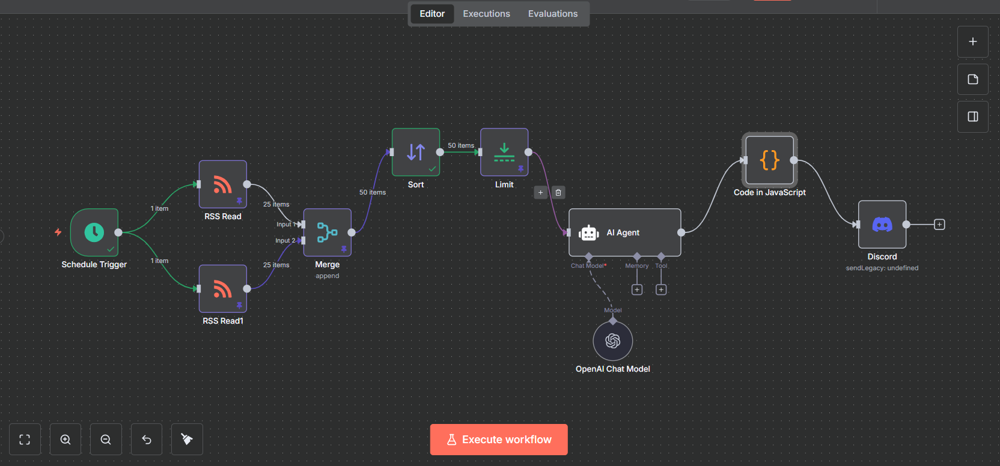
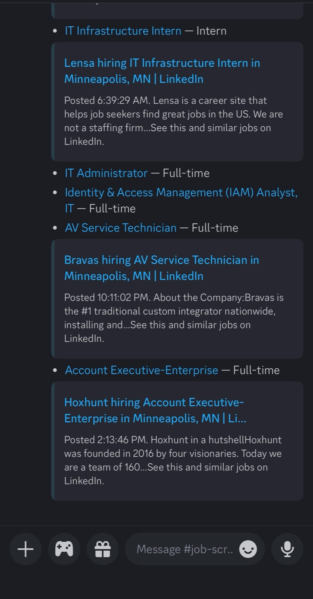

# #2. Job-scraper (n8n-workflow)

<h3 align="center">What does this do</h3>

Okay so I may be addicted to n8n a little, but this time I decided to do something a little complex than the previous workflow. This process pulls curated RSS job feeds sorts them, filters for entry-level or internship positions in IT, Cybersecurity, Networking, or Systems, and then pushes the results to my Discord channel.


<h3 align="center">Workflow overview</h3>

* **Trigger:** Schedule trigger
* **Job chain:** RSS Read (x2) → Merge → Sort → Limit → AI Agent → JavaScript Filter → Discord

<figure><figcaption><p>Workflow canvas</p></figcaption></figure>


LinkedIn doesn’t really give you RSS feeds out of the box especially for search pages. You can generate them with RSSMaker while signed out.



<h3 align="center">Node highlights</h3>

1. **RSS Read nodes**

* Pull job postings from multiple feeds (LinkedIn, Indeed, etc.).
* Each feed gives \~25 items that get merged.

<figure><figcaption></figcaption></figure>

2. **Merge + Sort**

* Combine both feeds and sort by pubDate in descending order.
* Keeps things fresh by showing newest jobs first.

<div align="center" data-full-width="true"><figure><figcaption></figcaption></figure></div>

3. **AI Agent (Filtering)**

* Uses an OpenAI Chat Model to check each job and decide if it’s an **Intern / Entry-level role** in IT/Cyber/Networking/Systems.
* Prompt makes sure senior/lead/manager postings don’t slip through.

<figure><figcaption></figcaption></figure>


**Prompt:**&#x20;

You are an assistant analyzing job postings.

Input: Title: \{{$json\["title"]\}} Link: \{{$json\["link"]\}} Description: \{{$json\["contentSnippet"]\}}

TASK:

1. Check if the job is ENTRY-LEVEL or an INTERNSHIP in IT, Cybersecurity, Networking, or Systems.
   * Include if it's clearly for beginners, eg.(intern, junior, associate, SOC Analyst I, tier 1, 0–2 years exp).
   * Exclude senior, lead, manager, director roles.
2. If valid, output a single Markdown bullet line:

* \[Job Title]\(Job Link) — Label

Where Label is one of: Intern / Full-time / Part-time / Contract\
(based on job text; if unclear, default to Full-time).

3. Output nothing if the job doesn’t match.


**Error + Fix (JavaScript filter)**

* Problem: AI Agent sometimes spat out blank results for non-matching jobs → Discord node broke.
* Fix: Added a **Code in JavaScript** node to drop empty items before they hit Discord.

```
return items.filter(item => {
  const text = item.json.output || item.json.text || "";
  return text.trim().length > 0; // keep only non-empty
});
```


More tokens = more \$$$. To save on usage, I let n8n handle some of the filtering logic with a quick JavaScript function before sending stuff downstream.


4. **Discord node**

* Sends clean Markdown-formatted job posts to my jobs channel.


<h3 align="center">Output</h3>

* Here you can see final message that gets sent to the Discord cannel. On n8n's end as well you can see the final schema showing the pipeline from start to finish.&#x20;

<p align="center">  </p>

<figure><figcaption><p>Schema</p></figcaption></figure>

<h4 align="center">Wrap-Up</h4>

This workflow basically pulls fresh listings, filters out senior jobs and drops only relevant internships and entry-level roles straight into Discord. Between the AI Agent and the little JavaScript cleanup, it runs smooth without wasting tokens.&#x20;

