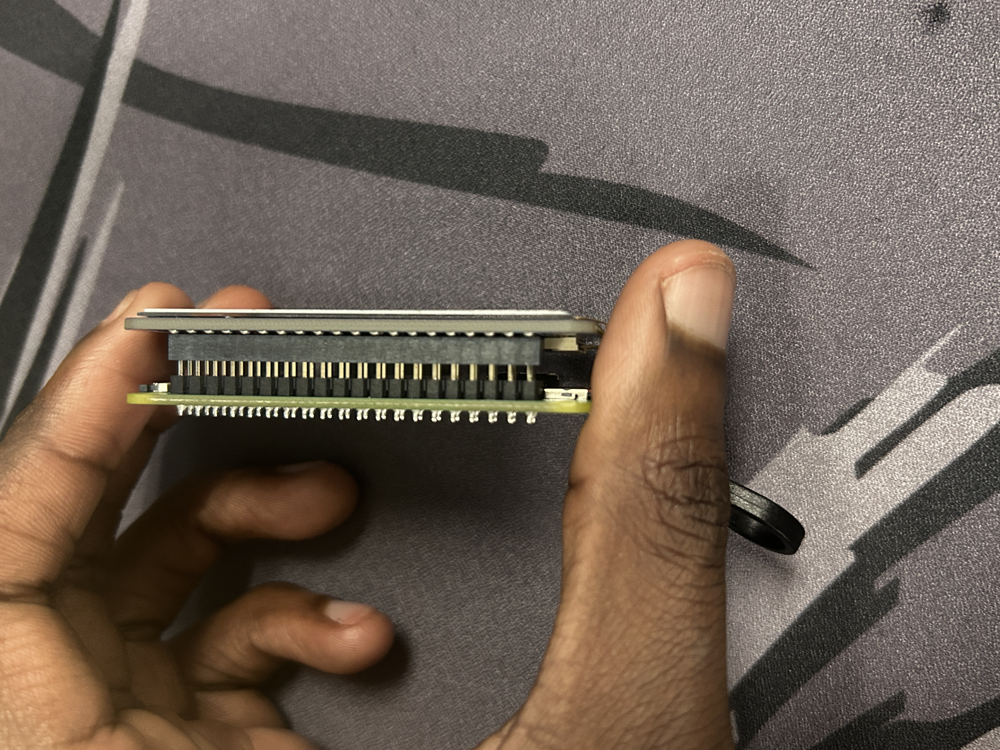
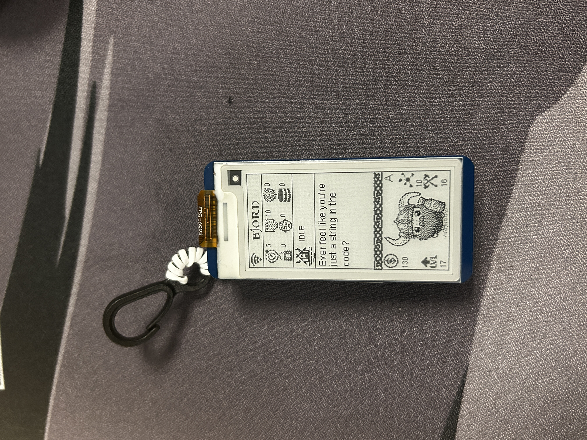

# #2. Bjorn

<h3 align="center"><em>What is Bjorn?</em></h3>

So, I’ve been keeping an eye on this project for a while and finally decided it was time to give it a try. **Bjorn** is an open-source pen-testing tool with a ton of personality (big fan of the Viking theme). It’s a super lightweight tool that can run on tiny boards like the Pi Zero, yet still packs a punch with automated network scanning, vulnerability assessments, and even some dictionary attacks.

<h3 align="center"><em>Putting it together</em></h3>

#### Hardware

* Pi zero with headers
* SD card&#x20;
* E paper display
* Micro usb cable&#x20;

Putting Bjorn together was pretty straight-foward, if you have the Pi with headers you just have to slap the display on top of it run the automated installation script on from the github below and that's pretty much it.

#### Software&#x20;

So for this step you would have to clone the repo from [**https://github.com/infinition/Bjorn**](https://github.com/infinition/Bjorn) , this github has pretty much everything  you would need for the install including steps, FAQs, etc.

<figure><figcaption></figcaption></figure>

<figure><figcaption></figcaption></figure>

<h3 align="center">Actual fun stuff</h3>

#### Getting connected

Upon first connection Windows recognized something was plugged in but there wasn't any devices, tuns out Bjorn uses **RNDIS drivers** over USB which makes Bjorn show up as a network device. So after that was done, docs recommended to set the network device to a manual IP of 10.0.0.1 which assigns Bjorn with 10.0.0.2 automatically.&#x20;

From that point you can SSH in with the default credentials or whatever was set during the installation script. Next thing i did was go to the GUI.&#x20;

From here you can also connect to your WIFI network and once its gets an IP address it goes straight to work.

<figure><figcaption>
Bjorn Dashboard
</figcaption></figure>

#### Features that stood out

There's a lot of features that come straight out the box but to keep the write-up short I''m just going to highlight on the ones that caught my attention.&#x20;

1. This is a small section that highlights some parameters for scanning like,

* &#x20;Portlist: out of the box has most of the well known ports&#x20;
* Mac blacklist: lets you block mac addresses that you don't want to scan/attack, same deal for IP blacklist.
* &#x20;Steal file names: this shows files from open shares/weak on a network, same deal as well for the file extensions
* Nmap aggressivity: by default I think this is set to -T2 to minimize noise if you want to be a little stealthier, i did T4 since I was testing this on a test network

<figure><figcaption></figcaption></figure>

2. The scanning process for Bjorn. So I noticed that Bjorn has two modes 'AI' mode which is just automated scanning according to what parameters you set and a manual mode. The automated mode cycles through various attacks, scans etc. while in the manual mode you can pick a host and the mode you want it to run in.

* &#x20;On my test network, it flagged about 90 vulnerabilities. It also picked up on some hosts and a few ports. Not all ports showed up since I set up some custom ones that aren’t on the usual list. I'm planning to dive deeper into these vulnerabilities and other findings in the security section of my portfolio. Stay tuned!.

<figure><figcaption>
Manual mode
</figcaption></figure>

<figure><figcaption>
Bjorn running in AI mode
</figcaption></figure>

<figure><figcaption>
Scan is done 
</figcaption></figure>

<h3 align="center">Closing thoughts</h3>

Overall I really like this project because its a good mix of automation and manual tewaks which just makes learning about this stuff more interactive, and its fairly cheap and easy to build.  For my lab use, it did exactly what I needed: quick discovery, vulnerability highlights, and enough knobs to push it harder. Next steps for me will be experimenting with those improvements, while also looking at how extras like Bluetooth tethering and Tailscale can make access more reliable.

<h3 align="center">Extras</h3>

coming soon...
