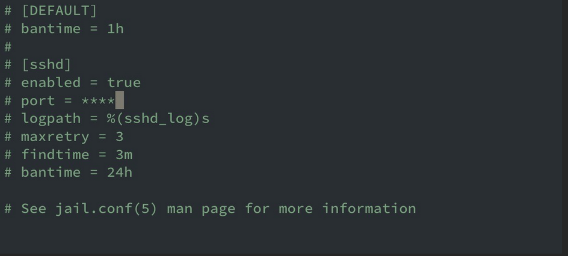

# Part 2 - Security

* Switched ssh and dahsboard console ports from default (8443, 22) to custom, also disabled ssh password login, root login and allowed login via keys only&#x20;

<figure><figcaption></figcaption></figure>

* Installed and configured Fail2Ban (this prevents brute-force attacks) and Whitelisted all trusted IPS in the jail.

<figure><figcaption></figcaption></figure>
