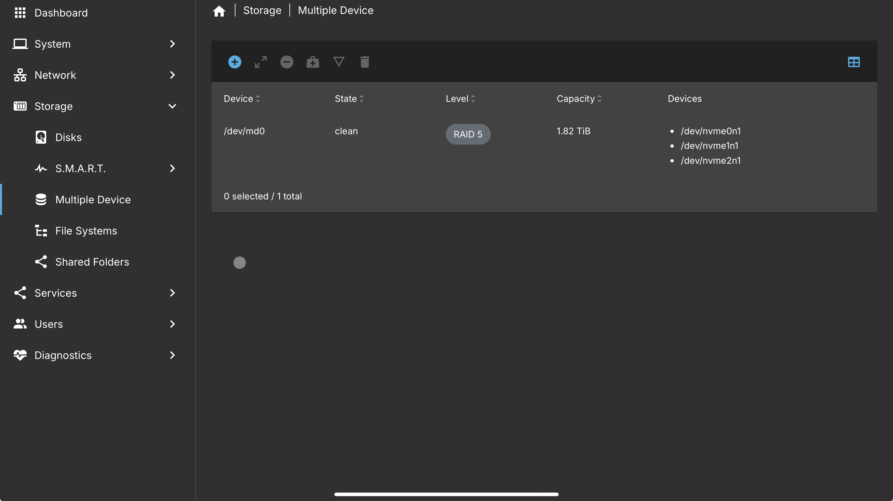

# Part 1 - Storage/user access

* Implemented RAID 5 using the 3 NVMe SSDs and created and mounted the RAID volume via the OMV GUI.&#x20;

<figure><figcaption>
RAID configuration
</figcaption></figure>

<figure><figcaption>
Disk health 
</figcaption></figure>

* &#x20;Created users and provisioned them, I also made shares and assigned what user has access to the shares.  &#x20;

<figure><figcaption>
Users and groups
</figcaption></figure>

<figure><figcaption>
Shared folder list
</figcaption></figure>

<figure><figcaption>
permissions per shared folder (guestshares)
</figcaption></figure>
